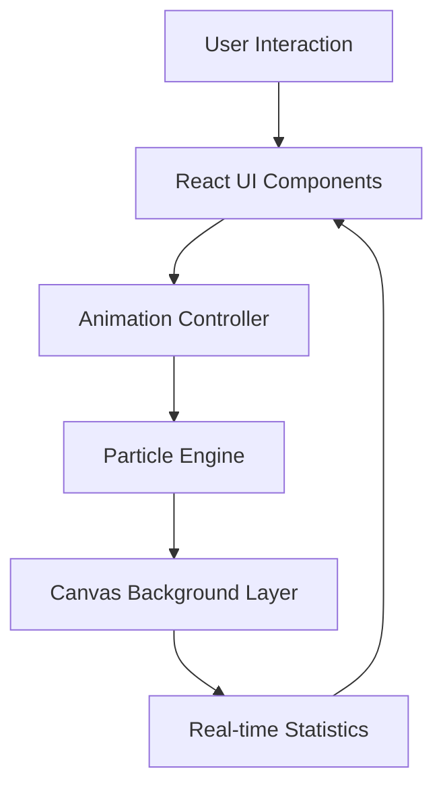
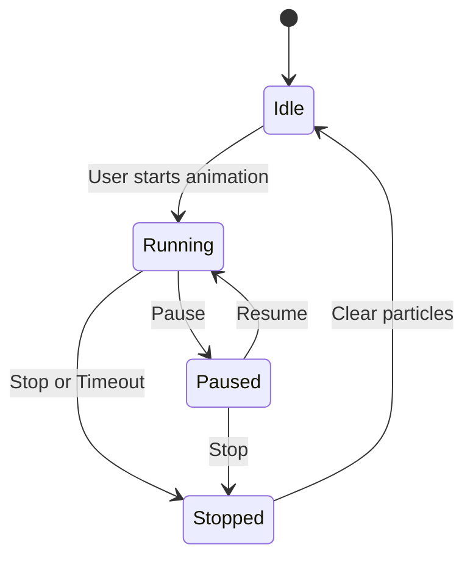
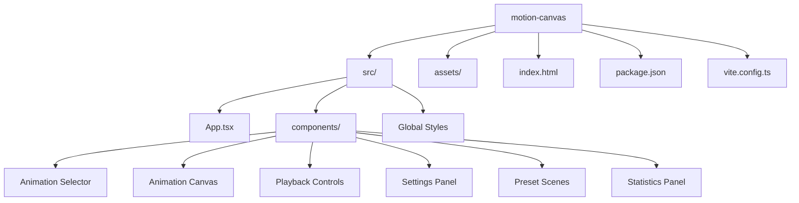
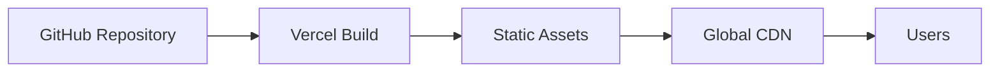

# Ambient Motion Studio 

**An interactive animation playground featuring elegant particle effects, handcrafted visuals, and a warm editorial design.**


---

## Overview

**Ambient Motion Studio** is an interactive animation playground built with **React**, **TypeScript**, and **Vite**.

It enables users to explore multiple particle-based animations—including **Snowflakes**, **Balloons**, **Confetti**, **Bubbles**, and **Fireworks**—through a clean, responsive, and customizable interface.

Unlike many animation demos that rely on flashy visuals, Motion Canvas embraces a **warm editorial aesthetic** inspired by modern reading and productivity applications. The result is an interface that feels calm, handcrafted, and approachable.

This project was developed as part of the **Kaggle 5-Day AI Agents: Intensive Vibe Coding Course With Google**.

---

## Live Demo

https://ambient-motion-studio.vercel.app

---

## Features

### Five Interactive Animations

- ❄️ **Snowflakes** – Smooth falling snow with gentle drift.
- 🎈 **Balloons** – Balloons floating naturally from bottom to top.
- 🎊 **Confetti** – Rotating confetti pieces with randomized movement.
- 🫧 **Bubbles** – Transparent bubbles rising with soft motion.
- 🎆 **Fireworks** – Colorful fireworks exploding into animated particles.

---

### Customization Controls

- Animation Duration (1s – 10s)
- Particle Count (20 – 100)
- Particle Size
  - Small
  - Medium
  - Large

---

### Playback Controls

- Pause animations
- Resume animations
- Stop and clear particles

---

### Quick Presets

Pre-configured animation scenes:

- **Calm** → Soft bubbles with slow movement
- **Celebration** → Confetti + Fireworks
- **Winter** → Large drifting snowflakes

---

### Live Statistics

Real-time display of:

- Current animation
- Particle count
- Particle size
- Animation duration
- Active particles on screen

---

## Tech Stack

| Category | Technology |
|----------|------------|
| Frontend Framework | React 19 |
| Language | TypeScript |
| Build Tool | Vite |
| Styling | Tailwind CSS |
| Animation | Motion |
| Rendering | HTML5 Canvas |
| Prototyping | Google AI Studio |
| Deployment | Vercel |

---

# Architecture

Motion Canvas follows a component-driven architecture where user interactions flow into a centralized animation controller responsible for spawning and updating particles.



---

# Animation Lifecycle

Every animation follows a predictable lifecycle:



---

# Project Structure


---

## Local Setup

### Clone the repository

```bash
git clone https://github.com/Nataraj-EL/kaggle-vibe-motion-canvas.git

cd kaggle-vibe-motion-canvas
```

### Install dependencies

```bash
npm install
```

### Start the development server

```bash
npm run dev
```

Open:

```text
http://localhost:3000
```

---

### Build for production

```bash
npm run build
```

---

## Deployment

The application is deployed on **Vercel**.



Every push to the `main` branch automatically triggers a new deployment.

---

## About the Kaggle Course

This project was developed as part of the **Kaggle 5-Day AI Agents: Intensive Vibe Coding Course With Google**.

The course focuses on:

- AI-assisted prototyping
- Vibe coding workflows
- Rapid iteration with generative AI
- Building interactive applications using Google's AI ecosystem

Motion Canvas was initially prototyped using **Google AI Studio** and later refined with a custom editorial UI, improved animation layering, and reusable animation components.

---

## Future Improvements

- Web Audio API powered sound effects
- Custom particle generators
- WebGL accelerated rendering
- Export animations as GIF or video
- Additional themes and animation presets

---

<div align="center">

**Built by Nataraj EL**

© 2026 Nataraj EL. All Rights Reserved.

</div>
